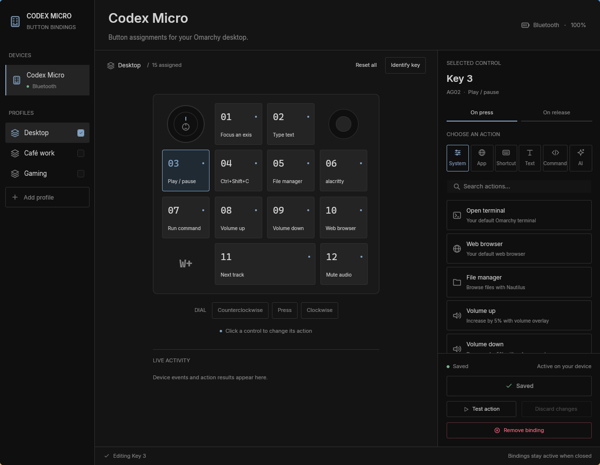
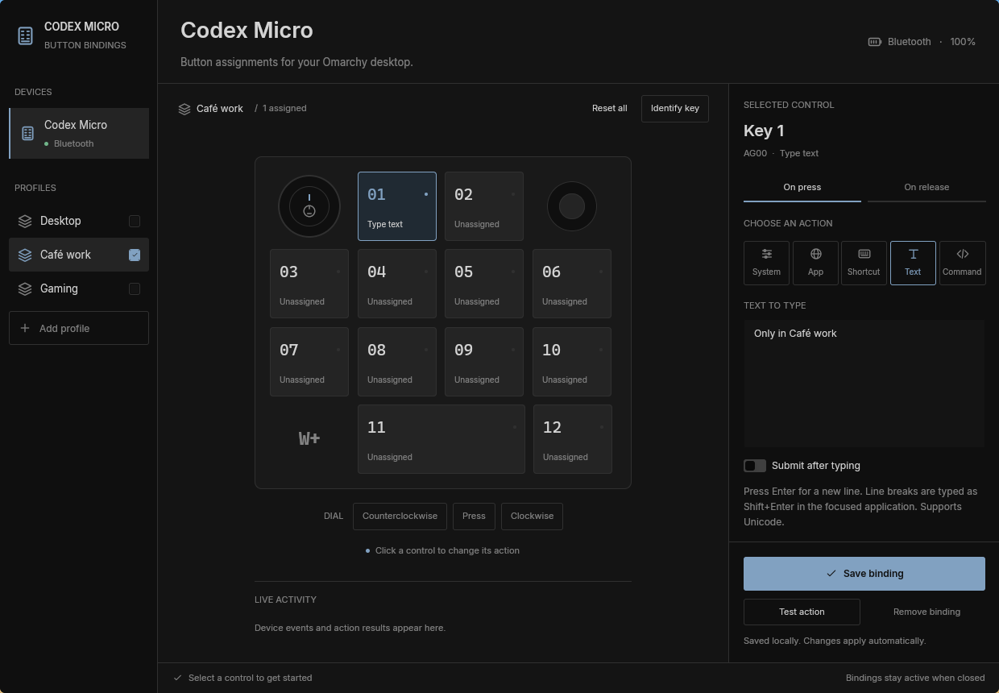
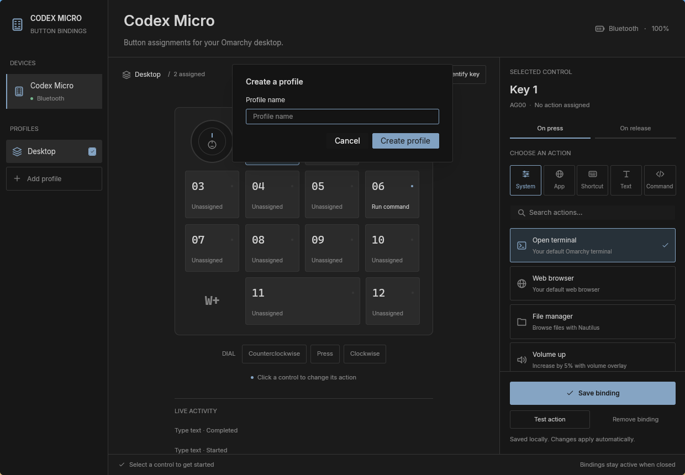
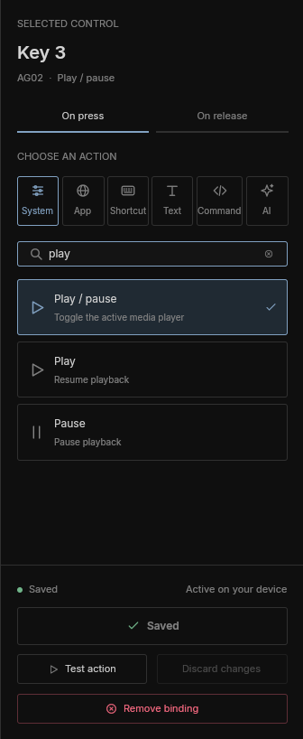
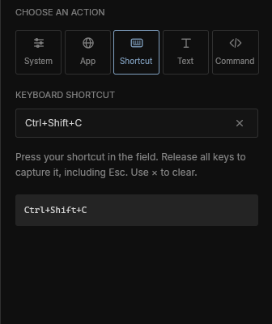
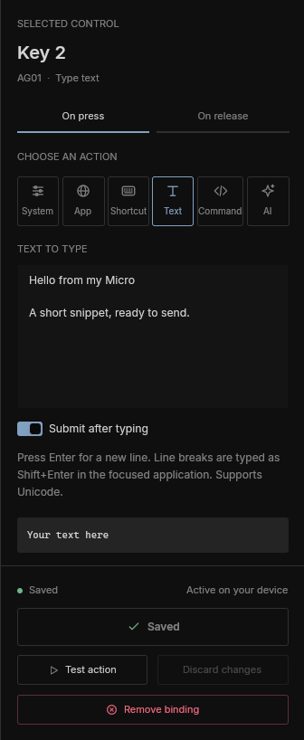

# codex-micro-omarchy

Codex Micro maps your buttons and dial to apps, shortcuts, text, commands,
and Omarchy actions. Its native Rust and GPUI editor uses your desktop colors,
and a background service keeps bindings active after you close the window.



## Install

Run this on Omarchy in a graphical session. You need a current stable Rust
toolchain and a working Vulkan graphics driver. Text actions use `wtype`.

Install the build tools and libraries on Arch:

```sh
sudo pacman -S --needed base-devel rust clang pkgconf \
  fontconfig libxcb libxkbcommon libxkbcommon-x11 wayland \
  vulkan-icd-loader wtype
```

If you already use Rustup, omit `rust` and keep your stable toolchain.
Omarchy provides the Hyprland, audio, media, and screenshot commands used by
the system actions.

Clone or download this repository, then run these commands from its directory:

```sh
./scripts/install.sh
codex-micro
```

The installer builds the release binary, adds Codex Micro to the application
launcher, and enables its systemd user service. The service starts with your
graphical session. Run the installer again to update the app, then reopen the
editor. It preserves your saved bindings.

### Device permissions

Connect the Micro by USB or pair it over Bluetooth. Linux's existing HID driver
handles both connections.

If the app reports that it cannot access the device, install the included udev
rule:

```sh
sudo install -Dm644 udev/70-work-louder.rules /etc/udev/rules.d/70-work-louder.rules
sudo udevadm control --reload-rules
```

Reconnect the device afterward. The rule grants the active local user access
to the Codex Micro device identified by `303a:8360`.

## Features

### Profiles

Click **Add profile** below the profiles list, enter a name, and click **Create
profile** or press Enter. **Cancel** or Escape closes the dialog without saving.
New profiles start with no bindings and leave the current profile active.

Click a profile's checkbox to activate it. Exactly one profile stays active.
The editor shows that profile's bindings, and the service reloads them
automatically. Each profile keeps its own button and dial assignments.
Switching profiles discards the current unsaved form and clears **Undo reset**.
The profiles and active selection persist when you close the app.





### Buttons, dial, and press/release bindings

The device view numbers the twelve buttons 01 through 12, so the labels still
make sense when you swap keycaps. You can also bind the dial press and each
rotation direction. The joystick appears in the drawing for orientation;
joystick binding is not implemented.

1. Click a control, or click Identify key and press the physical control.
2. Choose On press or On release. Dial rotation uses On turn for each step.
3. Choose System, App, Shortcut, Text, or Command and fill in the action.
4. Click Save binding. Ctrl+S also saves unless the shortcut field is focused.

Switching between On press and On release keeps the entire form, including
the text submit toggle. Save binding writes that form to the selected event.
The service reloads saved bindings automatically.

Test action runs the current form without saving it. Shortcut and text actions
go to the focused application, so use the physical control with that
application focused to try a saved binding.

### System actions

Choose a preset for a desktop action:

| Group | Available actions |
| --- | --- |
| Applications | Open terminal, web browser, file manager |
| Audio | Volume up, volume down, mute |
| Playback | Play / pause, play, pause, next track, previous track |
| Workspaces | Next workspace, previous workspace |
| Screenshots | Capture a region |

Volume changes in 5% steps and shows Omarchy's volume overlay. Playback uses
Omarchy's media controls.

Search actions filters names and descriptions. Only the results list scrolls;
the search field, category tabs, and save controls stay in place.



### Applications

Choose App and enter an application command. Arguments and quoted paths work:

```sh
firefox
notify-send "Hello from my Micro"
"/home/you/Applications/My App" --new-window
```

The app runs the executable with those arguments. Use Command for pipes,
variables, or other shell syntax.

### Keyboard shortcuts

Choose Shortcut, click the field, and press your combination. The preview
appears while you hold the keys. The field commits the shortcut when every
key and modifier has been released.

You can bind single keys such as Esc, Tab, and F5, or combinations such as
Ctrl+Shift+C and Super+Return. While recording, Ctrl+S becomes a shortcut
instead of saving the editor. Modifier keys alone do not form a shortcut.

Click the cross on the right to clear the field and record another shortcut.
Click Save binding to assign the completed value. Remove binding deletes an
existing assignment.



### Text snippets

Choose Text and write a snippet in the textarea. Enter adds a line break;
blank lines and Unicode are preserved when you save and reload the binding.

Enable Submit after typing to send one extra Enter after the entire snippet.
The setting belongs to that binding and defaults to off. Leave it off to
insert text without submitting it. Text delivery uses `wtype`.
Snippet line breaks, including a trailing line break, are sent as Shift+Enter
so they do not submit chats that use Enter to send. The target app must support
Shift+Enter for a new line.



### Shell commands

Choose Command to run a command or script with `sh -c`. Pipes, variables,
redirection, and shell quoting work here:

```sh
notify-send "Time for a break"
printf '%s\n' "$(date)" >> "$HOME/micro-notes.txt"
```

Live activity shows device events and action results. If a command cannot
start or exits with an error, the app reports it there.

### Remove, reset, and undo

Remove binding clears only the selected control and event. Reset all removes
every binding, including release events and dial rotations.

Undo reset restores the previous bindings until you make another binding
change or close the editor. New installations start with no bindings.

### Theme and local configuration

The editor reads your current Omarchy colors when it opens. Restart it after
switching desktop themes.

| File | Purpose |
| --- | --- |
| `~/.config/work-louder/bindings.toml` | Profiles, active selection, and saved actions |
| `~/.local/state/omarchy/current/theme/colors.toml` | Desktop colors |

The app imports existing single-profile files without losing their bindings.
The next save writes all profiles and the active index to the same file.
The paths follow `XDG_CONFIG_HOME` and `XDG_STATE_HOME` when set. Bindings stay
on this computer and run through the local service.

For example, this file has Desktop active and an empty Work profile. Desktop
assigns a text snippet to button 05 and volume up to a clockwise dial step:

```toml
active = 0

[[profiles]]
name = "Desktop"

[profiles.bindings.AG04.press]
kind = "text"
text = """Thanks for the review!

I will take a look and get back to you."""
submit = true

[profiles.bindings.ENC_CW.step]
kind = "preset"
preset = "volume_up"

[[profiles]]
name = "Work"
```

The file uses firmware control IDs. Button 05 is `AG04`; button 11 keeps the
ID `MIC`. Validate manual edits with `codex-micro --check-config`. If an edit
is invalid, the running service keeps its last valid configuration and
reports the error.

### Connection and troubleshooting

The header shows the connection type, battery level, and charging state.
A USB cable can charge the Micro while its active connection is Bluetooth.
The app reconnects when the device becomes available again.

The Micro must use a layer that emits Codex vendor events. This project has
been tested with firmware `v0.4.1`, profile `0`, and layer `1` over Bluetooth
while charging over USB. Button 11 combines its two physical switches into
one press and one release.

Read device status, check your bindings, or inspect the service logs:

```sh
codex-micro --status
codex-micro --check-config
systemctl --user status codex-micro.service
journalctl --user -u codex-micro.service
```

If another program is reading the same vendor HID channel, stop it before
starting this service.

## Contributing

Bug fixes, new actions, UI improvements, documentation, and hardware reports
are welcome. For a bug report, include the steps to reproduce it, the device
transport and firmware, and any relevant service log output.

### AI-assisted contributions

AI-assisted and AI-generated contributions are welcome. Use the tools that
help you get the work done. You are responsible for understanding the change
and checking that it works.

Keep pull requests focused. Explain the problem, what changes for the user,
and which checks you actually ran. Include screenshots for visible UI changes.
If you could not test on a Micro, say what you verified and what still needs
a hardware check. Generated code gets the same review as any other code.

### Run from source

```sh
cargo run --locked
cargo run --locked -- --status
cargo run --locked -- --check-config
```

The editor starts the service if needed. An installed service uses the
installed binary; to test changes to the daemon, stop that service and run
the source version in a separate terminal:

```sh
systemctl --user stop codex-micro.service
cargo run --locked -- --daemon
```

When finished, stop that process and restore the installed service with
`systemctl --user start codex-micro.service`.

### Check a change

Run these checks for Rust changes:

```sh
cargo fmt --check
cargo clippy --locked --all-targets -- -D warnings
cargo test --locked
```

The unit tests cover HID framing, button switch handling, shortcut recording,
socket requests, configuration reloads, and atomic saves. They do not require
a connected Micro.

For a native UI check, install the current build and run this in your Omarchy
session. The Rust verifier needs `grim` and ImageMagick:

```sh
./scripts/install.sh
cargo run --locked --example verify-native
```

To check only profile creation, activation, and persistence, run
`cargo run --locked --example verify-native -- --profiles`.

It opens an editor with temporary profiles, checks the visible fields and
keyboard input, saves and reloads bindings, and tests execution through the
running service. It also checks profile creation, cancellation, activation,
binding isolation, restart persistence, text submission, Esc recording, reset and
undo, and media assignments. The verifier leaves your saved bindings and
desktop pointer alone. It focuses the temporary window for text delivery,
captures screenshots in `artifacts/`, and closes that window afterward. On
failure, it saves a screenshot and reports which check failed. The app log
is stored in `artifacts/native-session.log`.

Set `CODEX_MICRO_BINARY` to check another build of the app. The verifier uses
the installed binary by default, and text submission checks run through the
installed service.

To check text delivery against a chat-style input, run:

```sh
cargo run --locked --example verify_text_delivery
```

This opens a temporary local input where Enter sends and Shift+Enter adds a
line break. It checks both submit settings with trailing and blank lines,
Unicode, CRLF, and snippets that start with hyphens. It uses the installed
service, sends no messages outside the test window, and leaves bindings alone.

The automation socket is opt-in through `CODEX_MICRO_CONTROL_SOCKET` and
allows access only to the current user. Documentation screenshots live in
`docs/screenshots/`; use sample bindings when capturing replacements.

### Find the code

| Path | What lives there |
| --- | --- |
| `src/ui/` | Device view, editors, shortcut recording, native automation |
| `src/model.rs` | Controls, actions, validation, saved profiles |
| `src/protocol.rs` | HID reports and device input decoding |
| `src/daemon.rs`, `src/daemon/` | Device connection, action execution, IPC, config reloads |
| `src/theme.rs`, `assets/` | Omarchy colors and embedded icons |
| `scripts/install.sh` | Release build and installation |
| `examples/verify_native/` | Rust native UI and service verification |

Edit icons directly in `assets/icons/`. The Rust build script embeds the SVG
files automatically.

The [code quality review](docs/code-quality-review.md) records earlier
structural fixes and the checks used to verify them.

## License and credits

[MIT](LICENSE). Built with [GPUI](https://gpui.rs/) and
[GPUI Component](https://github.com/longbridge/gpui-component), using the
independently documented
[work-louder-oai protocol](https://github.com/boopdotpng/work-louder-oai/blob/25e154146c343b9c58cb70943a29bfb6c719dde6/docs/PROTOCOL.md).

This is an independent project, unaffiliated with Work Louder or OpenAI.
